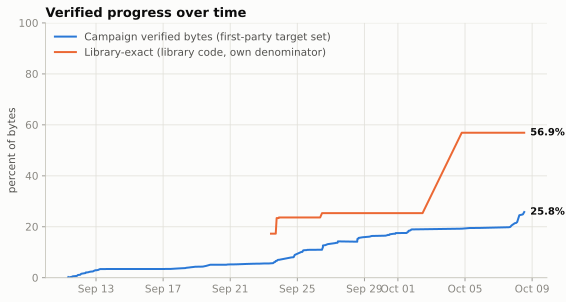
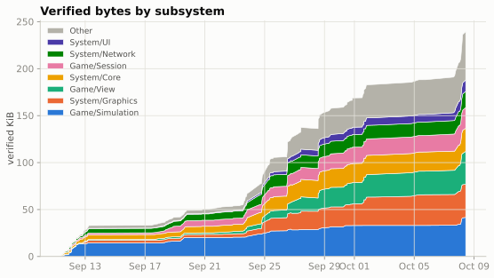
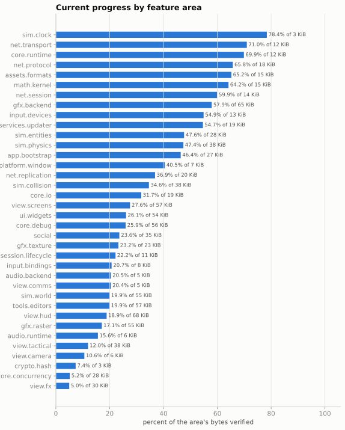
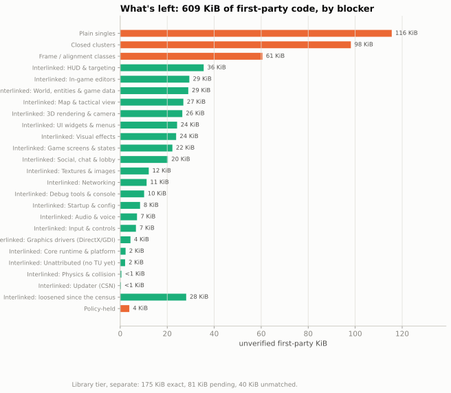
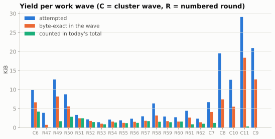

# Wulfram II Reconstruction Progress

Progress reports for a byte-exact reconstruction of the Wulfram II game client.

> **This repository tracks progress metrics only.** It holds numbers, charts and prose.
> The reconstruction itself (source code, game binaries, assets and build tooling) is
> not published here.

A dashboard version of this page lives in [`docs/index.html`](docs/index.html).
The raw numbers are in [`data/`](data), and every change to the measurement is listed in
[`CHANGELOG.md`](CHANGELOG.md).

<!-- HEADLINE:START (generated by the exporter; edits inside this block are overwritten) -->
## Headline numbers (snapshot of 2026-10-08)

| Metric | Value | What it counts |
|---|---:|---|
| **Campaign verified bytes** | **24.54%** | 1,877 functions, 242,065 of 986,454 first-party target bytes |
| First-party, library rows excluded | 25.54% | 242,065 of 947,693 bytes, with the rows found to be library code moved out of the denominator |
| **Library-exact** (separate line) | 56.9% | 172,330 of 302,789 bytes of statically linked library code; 90,593 more bytes pending |
| First-party code still to do | 705,628 bytes | broken down under "What's left" below |

The campaign figure started at 0.27% on 2026-09-11, when this measurement was adopted.
<!-- HEADLINE:END -->

Every byte in the byte-exact tier matches the original exactly. The few flagged categories
are explained in [How we count, and the exceptions](#how-we-count-and-the-exceptions) below.

## By subsystem

Verified bytes over time, grouped by the top two levels of the reconstructed source tree
(for example `Game/Simulation` or `System/Graphics`):

Current percent verified for each feature area (for example `net.protocol`, `sim.physics`,
`view.hud`). Each box is sized by the area's code and shaded by the share verified:

The same figures as bars, with each area's size:

## What's left

## Work waves

## How to read this

**What "byte-exact" means.** A function counts when its reconstructed source, compiled
with the same period compiler (Microsoft Visual C++ 2005) and the same flags, produces
exactly the machine code found in the original program. Every address reference in the
function is checked against the original, and a deliberate one-character change to the
source is shown to break the match, so the check cannot pass by accident. A small number
of functions (about 1% of verified bytes) are instead counted because a differential test
runs them against the original on recorded inputs and gets the same results.

**The separate metrics.**

- **Campaign verified bytes** is the headline. It is the verified bytes over all
  first-party target bytes: the game's own code, not counting the static C runtime and
  the bundled third-party libraries.
- **First-party excluding library rows** is the same figure after moving out of the
  denominator the functions that turned out to be at least 90% library code. It is
  reported next to the headline, never instead of it.
- **Library-exact** measures the statically linked libraries (the Visual C++ 2005 C
  runtime, Speex, bzip2 and libjpeg) against pinned original library objects. It has its
  own denominator and is never added to the first-party figure. "Pending" library bytes
  match with no disagreeing address reference, but not every reference is verified yet,
  so they are listed and not counted.
- A **draft-link tier** also exists for testing. It is provisional and diagnostic and is
  **not counted** anywhere; see the exceptions section below.

**How to read "what's left".** The unverified first-party bytes are grouped by what blocks
them:

- **Plain singles** are functions that can each be attempted on their own. This bucket
  includes a residual of code that the dependency census did not place in any group:
  large functions, functions heavy in floating-point code, and functions with complex
  exception handling.
- **Closed clusters** are groups of functions that whole-program optimisation tied
  together through custom register conventions. Each group must be rebuilt as a unit.
  They are split by size class in `data/remaining.json`.
- **Frame / alignment classes** are functions whose stack-frame shape depends on their
  callers or callees. They need the right neighbours compiled together.
- **The giant tangled component** is one connected web of more than 1,100 functions. It
  cannot yet be cut into small units under the current rules, and it holds almost half of
  what is left.
- **Policy-held** work is blocked by a process rule rather than by difficulty: it is
  reserved for another work lane, awaiting a ruling, or proven but not countable under
  the current rules.
- **Library-pending** bytes are reported separately under the library tier, because
  library code is not part of the first-party figure.

The buckets come from the most recent dependency census, minus everything verified since
it was taken. Between census refreshes the buckets can only shrink.

**Work waves** are batches of attempts. "Byte-exact in the wave" is what the wave matched.
"Counted in today's total" is what has since passed review and been admitted. Recent waves
show a gap until their results are reviewed.

<!-- EXCEPTIONS:START (generated by the exporter; edits inside this block are overwritten) -->
## How we count, and the exceptions

**Every byte counted in the byte-exact tier is identical to the original.** That is 239,520 bytes in 1,850 functions. Each one, recompiled with the period compiler (Microsoft Visual C++ 2005) and the original flags, gives exactly the original machine code. Every address reference agrees with the original, and a deliberate mutation of the source is shown to break the match.

The campaign headline is that tier plus 2,545 bytes (27 functions) verified by behaviour on a lower proof tier, 242,065 bytes in all. The flags below describe *how* a unit was admitted or attributed, meaning which evidence rules it relied on. Apart from the behaviour-verified row, they are not about bytes that fail to match. Each flag is listed so it can be revisited, and most are expected to be temporary.

| Category | Bytes | % of counted | Bytes identical? | Nature | Plan / status |
|---|---:|---:|:---:|---|---|
| Shared-context rule (provisional) | 1,279 (13 fn) | 0.53% | yes | Byte-identical. These functions sit in multi-function units whose only outside helpers are functions that were already verified; those helpers ride along unchanged as shared build context and are not counted a second time. The open question is the admission rule, not the bytes. | Gate rule under review. If it is tightened, the whole block can be taken out of the count in one step. |
| Behaviour-verified (lower tier) | 2,545 (27 fn) | 1.05% | not yet proven | Not yet byte-proven. Each function was run side by side with the original on recorded inputs and gave the same results, with a control that is able to fail. Counted in the campaign figure on a lower proof tier; not part of the byte-exact tier. | Expected to be temporary: these are meant to be replaced by byte-exact versions as their units are rebuilt. |
| Chosen local-variable names | 1,792 (5 fn) | 0.74% | yes | Byte-identical. The period compiler orders some stack slots by the spelling of local variable names. Where no evidence names the original variable, a name was chosen that reproduces the layout. | Evidence-quality flag; revisit if naming evidence turns up. |
| Invented helpers | 8,160 (32 fn) | 3.37% | yes | Byte-identical. The source uses a small helper the original may not have had, for example a stand-in caller that gives the compiler the right surrounding context. The helper itself is never counted. | Evidence-quality flag; revisit and replace with the original structure where it can be identified. |
| References to not-yet-named globals | 49,619 (248 fn) | 20.50% | yes | Byte-identical, and every reference lands on the same address as in the original. The referenced global or function simply has no independently backed name yet. | Naming work; the bytes and addresses already agree. |
| Older alignment annotation | 420 (4 fn) | 0.17% | yes | Byte-identical, but the source reproduces the stack frame with an explicit alignment annotation. A later study of frame alignment suggests the original was written differently. | Grandfathered; due to be re-ported the newer way. |

Apart from the behaviour-verified row, these flags describe how a unit was admitted or attributed (the evidence rules), not bytes that fail to match. A function can carry more than one flag, so the rows overlap and do not add up.

No provisional evidence rule is in effect on the library tier in this snapshot. Library-pending bytes are listed but never counted.

A **draft-link tier** also exists in the private workspace. It links drafted functions into a runnable program for testing. It is provisional and diagnostic, and it is **not counted** in any number here.
<!-- EXCEPTIONS:END -->

The same table, with function counts, is in `data/current.json` under `exceptions`.

## Updating

This repository is regenerated by an exporter that runs in the private workspace. The
exporter reads the measurement history and rewrites `data/`, `charts/`, `CHANGELOG.md` and
`docs/`. Before anything is written for publication, every output is scanned. The scan
looks for addresses, internal function names, source-like or assembly-like text, emails,
handles and internal paths. If it finds any, the export fails.

## License

The text, data and charts are licensed under [CC BY 4.0](LICENSE).
